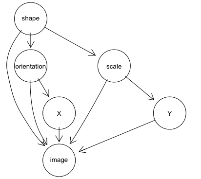
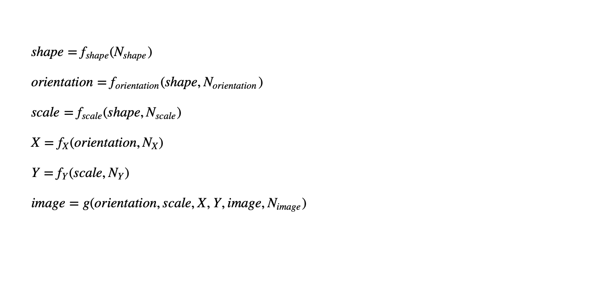
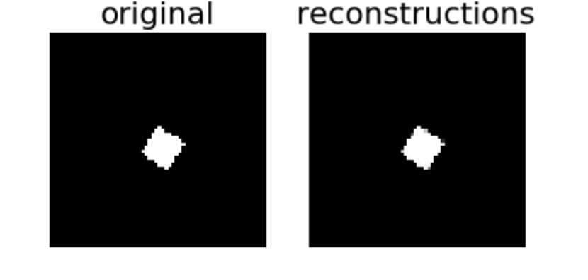
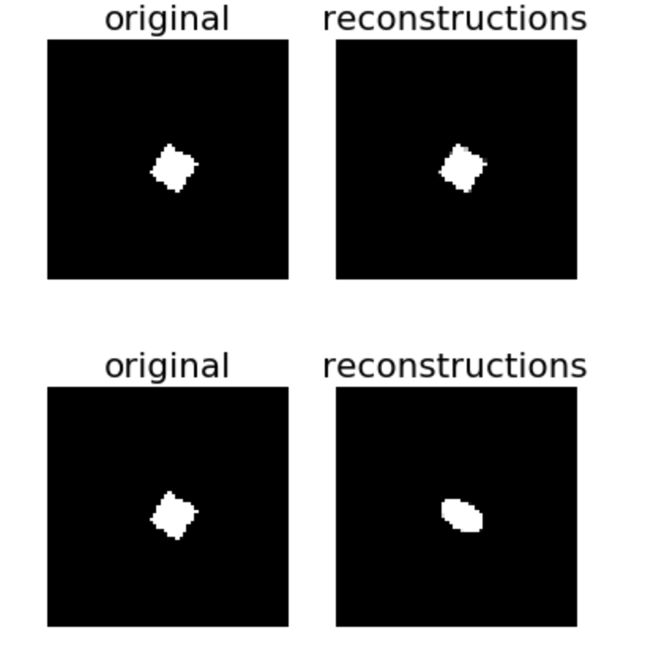
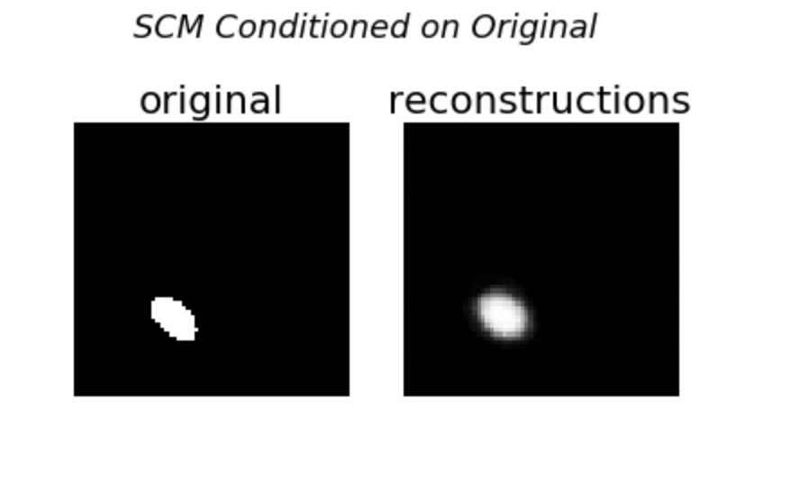
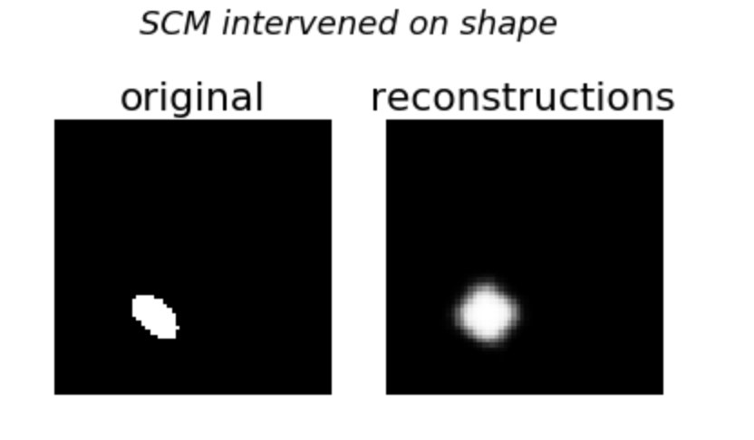
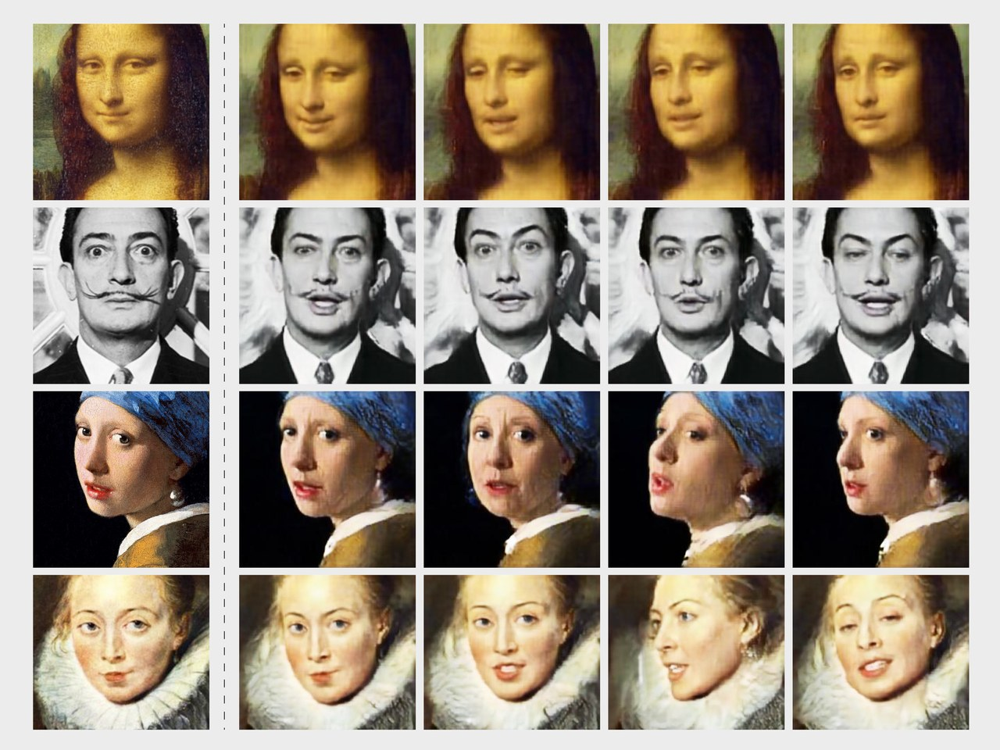

## Deep Causal Varitional Autoencoder

To train a supervised variational autoencoder using Deepmind's [dSprites](https://github.com/deepmind/dsprites-dataset) dataset.

dSprites is a dataset of sprites, which are 2D shapes procedurally generated from 5 ground truth independent "factors." These factors are color, shape, scale, rotation, x and y positions of a sprite.

All possible combinations of these variables are present exactly once, generating N = 737280 total images.

Factors and their values:

* Shape: 3 values {square, ellipse, heart}
* Scale: 6 values linearly spaced in (0.5, 1)
* Orientation: 40 values in (0, 2pi)
* Position X: 32 values in (0, 1)
* Position Y: 32 values in (0, 1)

There is a sixth factor for color, but it is white for every image in this dataset.

The purpose of this dataset was to evaluate the ability of disentanglement methods.  In these methods, you treat these factors as latent and then try to "disentangle" them in the latent representation.

However, in this project, these factors are not treated as latent, but are included as labels in the model training.  Further, a causal story is invented that relates these factors and the images in a DAG

 

Structural causal model is of the form:

 

The image variable will be a 64 x 64 array.  The noise term for the image variable will be the traditional Gaussian random variable. The structural assignment *g* for the image variable will be the decoder.

## Work:
* Built a Structural causal model that articulates a causal story relating shape, orientation, scale, X, Y, and the data.
* Resampled the dataset to get a new dataset with an empirical distribution that is faithful to the DAG and is entailed by the SCM
* To implement a causal VAE using [Pyro](http://pyro.ai/) by extending the primitive version of VAE. The VAE is fully supervised.
* Finally used the trained model to answer some counterfactual queries, for example, "given this image of a heart with this orientation, position, and scale, what would it have looked like if it were a square?"

## Optimization:
* The code is made compatible for GPU for faster processing.
* The learned weights are saved to avoid training frequently to enhance development efficiency.

## Results
* Achieved good reconstruction accuracy using vanilla VAE - 

* Trained VAE and made sure it recognises changes in the latent dimensions(Manually changed latent variables before training) - 

* Built structural causal model and verfied for reconstruction accuracy - 

* Counterfactual queries (1) - Intervention on shape - Given a oval and certain (x,y) co-ordinates and orientation, how would it look it was a sqaure? 

* Counterfactual queries (1) - Intervention on shape, position of (x,y) - 

## Applications
* DeepFakes :[Structured Disentangled Representations](https://arxiv.org/pdf/1804.02086.pdf) 

